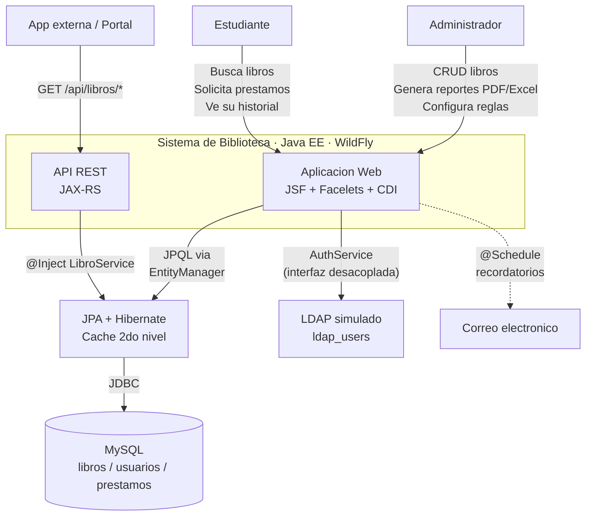
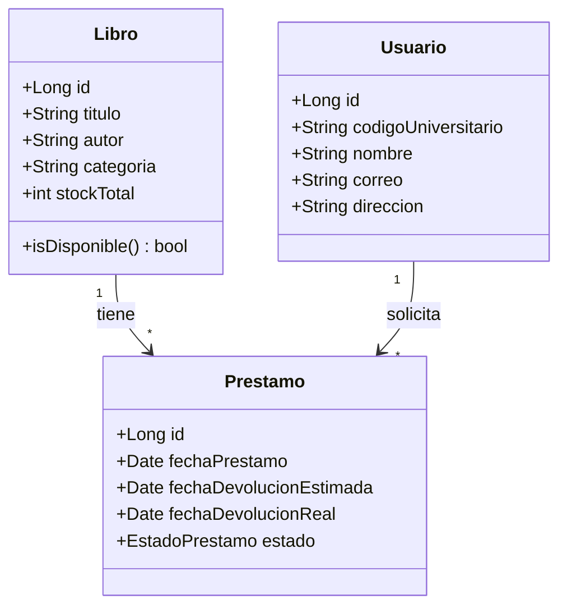

# Biblioteca Universitaria

### De hojas de calculo a un sistema automatizado

---

## El problema

Una biblioteca con 2,000+ libros, 5,000 estudiantes y 500 prestamos mensuales gestionada enteramente con Excel. El resultado: **30% de devoluciones fuera de plazo**, **15% de registros extraviados** cada mes y 5 personas dedicando horas a tareas que un sistema puede resolver en segundos.

---

## La solucion

Una aplicacion web empresarial Java EE que digitaliza por completo la operacion. El estudiante navega el catalogo, ve disponibilidad en tiempo real y solicita prestamos con un clic. El sistema notifica automaticamente cada vencimiento. El personal administra libros, configura reglas y genera reportes con **menos del 2% de margen de error**. Todo corre sobre WildFly y se comunica con MySQL mediante JPA e Hibernate.



---

## Que puede hacer cada usuario

### Estudiante

Explora el catalogo sin autenticación. Busca por titulo, autor o categoria. Ve la disponibilidad real —calculada en vivo contando prestamos activos, nunca almacenada en una columna que pueda desincronizarse—. Solicita un prestamo y recibe al instante la fecha limite de devolucion. Consulta su historial completo y recibe recordatorios por correo 3 dias antes del vencimiento.

Los casos de uso con sus flujos y reglas de negocio estan detallados en [`documentacion/casos-de-uso.md`](documentacion/casos-de-uso.md).

### Administrador

CRUD completo del catalogo con validacion de ISBN. Configura la duracion de prestamos y el maximo de libros por estudiante (por defecto: 3, aplicado mediante `MaxLibrosValidator`, un `@FacesValidator` custom). Registra devoluciones: el sistema compara automaticamente `fechaDevolucionReal` contra `fechaDevolucionEstimada` y marca `PENALIZADO` si hubo atraso. Genera reportes en PDF (JasperReports) o Excel (Apache POI) con datos obtenidos via JPQL.

### Sistemas externos

Consumen la API REST publica. Dos endpoints sin autenticacion:
```
GET /api/libros/{id}/disponibilidad  →  { "disponible": true, "stockDisponible": 3 }
GET /api/libros?titulo=&autor=       →  [ { "id": 1, "titulo": "...", "disponible": true } ]
```

---

## Como esta construido

Arquitectura **monolitica en 4 capas**, desplegada como un solo `.war` pero con separacion estricta interna mediante CDI:

| Capa | Implementacion | Responsabilidad |
|---|---|---|
| Presentacion | JSF 4.0 + Facelets XHTML | Vistas, Managed Beans (`@Named`, `@SessionScoped`), navegacion |
| Negocio | CDI 4.0 + Weld | `LibroService`, `PrestamoService`, `AuthService`, validadores `@FacesValidator` |
| Persistencia | JPA 3.1 + Hibernate 6.2 + EhCache 3.10 | Entidades con `@OneToMany`/`@ManyToOne`, JPQL, cache 2do nivel |
| Datos | MySQL 8.0 | Tablas `libros`, `usuarios`, `prestamos` (dominio) + `ldap_users` (autenticacion) |

Las 10 decisiones arquitectonicas (ADRs) que respaldan cada eleccion, los 4 diagramas C4 en Mermaid y la seccion JPQL completa estan en [`documentacion/decisiones-tecnicas.md`](documentacion/decisiones-tecnicas.md).

### Modelo de datos (entidades JPA)



- `Usuario` **no almacena contraseña**. La autenticacion se delega a `ldap_users` via la interfaz desacoplada `AuthService`.
- La disponibilidad (`isDisponible()`) es `@Transient`: se calcula restando los prestamos activos/vencidos del `stockTotal`. Fuente unica de verdad, cero inconsistencias.
- Las consultas usan **JPQL** sobre entidades, no SQL sobre tablas. Si la base de datos se migra, las consultas no se rompen. Ejemplo:

```java
TypedQuery<Prestamo> query = em.createQuery(
    "SELECT p FROM Prestamo p " +
    "WHERE p.fechaDevolucionEstimada < :hoy " +
    "AND p.estado IN (:estados)",
    Prestamo.class
);
```

Las versiones exactas, el `persistence.xml`, las dependencias Maven y la configuracion de EhCache estan en [`documentacion/stack-tecnologico.md`](documentacion/stack-tecnologico.md). Las respuestas a las 5 preguntas del trabajo final con codigo de ejemplo estan en [`documentacion/preguntas-guia.md`](documentacion/preguntas-guia.md).

---

## Puesta en marcha

```bash
# 1. Requisitos
Java 17  ·  Maven 3.9+  ·  MySQL 8.0+  ·  WildFly 27+

# 2. Clonar
git clone <repo-url> && cd biblioteca

# 3. Base de datos
mysql -u root -p < sql/esquema.sql

# 4. Compilar y desplegar
mvn clean package
cp target/biblioteca.war $WILDFLY_HOME/standalone/deployments/

# 5. Abrir
# http://localhost:8080/biblioteca
```

---

## Indice de documentacion

| Documento | Vas a encontrar |
|---|---|
| [`documentacion/decisiones-tecnicas.md`](documentacion/decisiones-tecnicas.md) | 10 ADRs, 4 diagramas C4, seccion JPQL completa |
| [`documentacion/casos-de-uso.md`](documentacion/casos-de-uso.md) | 3 actores, 10 casos de uso con flujos, 10 reglas de negocio, 2 validadores |
| [`documentacion/stack-tecnologico.md`](documentacion/stack-tecnologico.md) | Java 17, WildFly 27, Hibernate 6.2, EhCache 3.10, dependencias Maven listas |
| [`documentacion/preguntas-guia.md`](documentacion/preguntas-guia.md) | 5 respuestas del trabajo final con codigo |
| [`docs/PDSD-644_TRABAJOFINAL.pdf`](docs/PDSD-644_TRABAJOFINAL.pdf) | Enunciado original del curso |

---

Curso **Gestores de Administracion Web** — PDSD-644 — Trabajo Final
