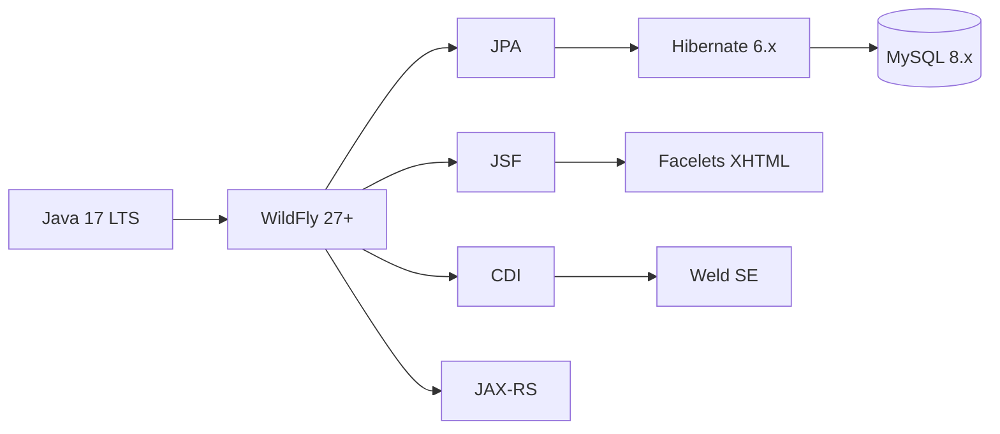

# Stack Tecnologico — Sistema de Gestion de Biblioteca Universitaria

## 1. Entorno de Ejecucion

| Componente | Tecnologia | Version propuesta | Justificacion |
|---|---|---|---|
| **Lenguaje** | Java SE | 17 (LTS) | Ultima version LTS con soporte extendido. Compatible con Jakarta EE 9+. |
| **Servidor de aplicaciones** | WildFly | 27+ | Servidor Java EE / Jakarta EE maduro, ligero, con soporte nativo para JSF, CDI, JPA y JAX-RS. Alternativa: Payara. |
| **Build tool** | Maven | 3.9+ | Estandar en proyectos Java EE. Gestion de dependencias, perfiles, plugins para despliegue. |
| **JDK distribution** | Eclipse Temurin | 17.0.x | OpenJDK gratuito mantenido por la Eclipse Foundation. |

---

## 2. Stack Principal



### 2.1 Capa de Presentacion

| Tecnologia | Version | Rol en el proyecto |
|---|---|---|
| **JSF (Jakarta Faces)** | 4.0 | Framework de componentes UI. Gestiona vistas XHTML, navegacion y ciclo de vida de Managed Beans. |
| **Facelets** | Integrado en JSF 4.0 | Motor de plantillas XHTML. Reemplaza a JSP. Permite vistas sin scriptlets Java. |
| **PrimeFaces** *(opcional)* | 13+ | Libreria de componentes UI enriquecidos (tablas paginadas, graficos, dialogos). No obligatorio, mejora la experiencia visual. |

**Paquete Maven:** `jakarta.faces:jakarta.faces-api:4.0.0`

---

### 2.2 Capa de Negocio

| Tecnologia | Version | Rol en el proyecto |
|---|---|---|
| **CDI (Jakarta Contexts and Dependency Injection)** | 4.0 | Inyeccion de dependencias entre capas. Gestiona el ciclo de vida de beans con scopes (`@SessionScoped`, `@ApplicationScoped`, `@RequestScoped`). |
| **Weld** | 5.x | Implementacion de referencia de CDI. Empaquetada con WildFly. |
| **Bean Validation (Jakarta Validation)** | 3.0 | Validaciones declarativas en entidades y beans (`@NotNull`, `@Size`, `@Pattern`). |

**Paquete Maven:** `jakarta.enterprise:jakarta.enterprise.cdi-api:4.0.0`

---

### 2.3 Capa de Persistencia

| Tecnologia | Version | Rol en el proyecto |
|---|---|---|
| **JPA (Jakarta Persistence)** | 3.1 | API de mapeo objeto-relacional. Define entidades, relaciones y consultas JPQL. |
| **Hibernate** | 6.2+ | Proveedor JPA. Ejecuta las consultas, gestiona el EntityManager y la cache de segundo nivel. |
| **EhCache** | 3.10+ | Proveedor de cache de segundo nivel de Hibernate. Reduce consultas repetitivas a MySQL sobre entidades de lectura frecuente (catalogo de libros). |

**Paquete Maven:** `org.hibernate.orm:hibernate-core:6.2.x`

**Configuracion en `persistence.xml`:**
```xml
<persistence-unit name="bibliotecaPU">
    <provider>org.hibernate.jpa.HibernatePersistenceProvider</provider>
    <shared-cache-mode>ENABLE_SELECTIVE</shared-cache-mode>
    <properties>
        <property name="hibernate.cache.use_second_level_cache" value="true"/>
        <property name="hibernate.cache.region.factory_class"
                  value="org.hibernate.cache.jcache.JCacheRegionFactory"/>
    </properties>
</persistence-unit>
```

---

## 3. Base de Datos

| Componente | Tecnologia | Version | Notas |
|---|---|---|---|
| **Motor de BD** | MySQL | 8.0+ | Motor relacional exigido por el curso. |
| **Driver JDBC** | MySQL Connector/J | 8.0+ | Driver JDBC para conexion de Hibernate con MySQL. |
| **Pool de conexiones** | HikariCP *(opcional)* | 5.x | Pool de conexiones de alto rendimiento. Alternativa: el pool por defecto de WildFly (IronJacamar). |

**Tablas:**
| Tabla | Contexto | Gestion |
|---|---|---|
| `libros` | Dominio | JPA / Hibernate |
| `usuarios` | Dominio | JPA / Hibernate |
| `prestamos` | Dominio | JPA / Hibernate |
| `ldap_users` | Autenticacion | JDBC directo |

---

## 4. API REST

| Componente | Tecnologia | Version | Rol en el proyecto |
|---|---|---|---|
| **JAX-RS (Jakarta RESTful Web Services)** | 3.1 | API estandar para servicios RESTful. Provee `@Path`, `@GET`, `@Produces`. |
| **RESTEasy** | Integrado en WildFly | Implementacion de JAX-RS incluida en WildFly. Serializa/deserializa JSON automaticamente. |
| **JSON-B (Jakarta JSON Binding)** | 3.0 | Serializacion de objetos Java a JSON para las respuestas de la API REST. |

**Paquete Maven:** `jakarta.ws.rs:jakarta.ws.rs-api:3.1.0`

**Endpoint:**
```
GET /api/libros/{id}/disponibilidad
GET /api/libros?titulo=&autor=
```

---

## 5. Reportes

| Componente | Tecnologia | Version | Rol en el proyecto |
|---|---|---|---|
| **PDF** | JasperReports | 6.20+ | Motor de reportes. Genera PDF desde plantillas JRXML alimentadas con datos JPQL. |
| **Excel** | Apache POI | 5.2+ | Generacion de archivos Excel (.xlsx) directamente desde consultas JPQL. |
| **JPQL** | Hibernate HQL/JPQL | — | Consultas orientadas a objetos para alimentar los reportes. Margen de error < 2%. |

---

## 6. Autenticacion

| Componente | Tecnologia | Version | Rol en el proyecto |
|---|---|---|---|
| **Interfaz de autenticacion** | `AuthService` (propia) | — | Interfaz desacoplada que define el contrato de autenticacion. |
| **Implementacion LDAP simulada** | `LdapAuthService` (propia) | — | Valida credenciales contra tabla `ldap_users` via JDBC. |
| **Hashing de contraseñas** | BCrypt (jBCrypt) | 0.4 | Almacena contraseñas en `ldap_users` con hash seguro. |
| **Implementacion LDAP real (futura)** | JNDI | API nativa Java | Conexion a servidor LDAP corporativo via `javax.naming`. |

---

## 7. Testing

| Componente | Tecnologia | Version | Proposito |
|---|---|---|---|
| **Unit testing** | JUnit | 5.10+ | Pruebas unitarias de servicios y validadores. |
| **Mocking** | Mockito | 5.6+ | Mock de dependencias CDI en pruebas unitarias. |
| **Testing de BD** | H2 Database *(opcional)* | 2.x | Base de datos en memoria para pruebas de integracion sin MySQL. |

---

## 8. Utilidades y Librerias Auxiliares

| Libreria | Version | Proposito |
|---|---|---|
| **Lombok** *(opcional)* | 1.18+ | Reduce boilerplate en entidades JPA (`@Getter`, `@Setter`, `@NoArgsConstructor`). Usar con precaucion en entidades JPA. |
| **SLF4J + Logback** | 2.0+ / 1.4+ | Logging estructurado para la aplicacion. |
| **Flyway** *(opcional)* | 9.x | Migraciones de esquema de base de datos versionadas. |
| **MapStruct** *(opcional)* | 1.5+ | Mapeo entre entidades JPA y DTOs si se requieren. |

---

## 9. Estructura de Dependencias Maven (resumen)

```xml
<!-- Jakarta EE -->
<dependency>
    <groupId>jakarta.platform</groupId>
    <artifactId>jakarta.jakartaee-api</artifactId>
    <version>10.0.0</version>
    <scope>provided</scope>
</dependency>

<!-- Hibernate -->
<dependency>
    <groupId>org.hibernate.orm</groupId>
    <artifactId>hibernate-core</artifactId>
    <version>6.2.0.Final</version>
</dependency>

<!-- Hibernate 2nd-level cache -->
<dependency>
    <groupId>org.hibernate.orm</groupId>
    <artifactId>hibernate-jcache</artifactId>
    <version>6.2.0.Final</version>
</dependency>
<dependency>
    <groupId>org.ehcache</groupId>
    <artifactId>ehcache</artifactId>
    <version>3.10.0</version>
</dependency>

<!-- MySQL driver -->
<dependency>
    <groupId>com.mysql</groupId>
    <artifactId>mysql-connector-j</artifactId>
    <version>8.0.33</version>
</dependency>

<!-- JasperReports -->
<dependency>
    <groupId>net.sf.jasperreports</groupId>
    <artifactId>jasperreports</artifactId>
    <version>6.20.0</version>
</dependency>

<!-- Apache POI -->
<dependency>
    <groupId>org.apache.poi</groupId>
    <artifactId>poi-ooxml</artifactId>
    <version>5.2.5</version>
</dependency>

<!-- BCrypt -->
<dependency>
    <groupId>org.mindrot</groupId>
    <artifactId>jbcrypt</artifactId>
    <version>0.4</version>
</dependency>

<!-- Testing -->
<dependency>
    <groupId>org.junit.jupiter</groupId>
    <artifactId>junit-jupiter</artifactId>
    <version>5.10.0</version>
    <scope>test</scope>
</dependency>
<dependency>
    <groupId>org.mockito</groupId>
    <artifactId>mockito-core</artifactId>
    <version>5.6.0</version>
    <scope>test</scope>
</dependency>
```

---

## 10. Resumen Visual del Stack

| Capa | Tecnologia | Version |
|---|---|---|
| **Lenguaje** | Java | 17 LTS |
| **Servidor** | WildFly | 27+ |
| **Build** | Maven | 3.9+ |
| **UI** | JSF + Facelets | 4.0 |
| **UI Mejorada** | PrimeFaces *(opcional)* | 13+ |
| **Inyeccion** | CDI + Weld | 4.0 / 5.x |
| **Persistencia** | JPA + Hibernate | 3.1 / 6.2 |
| **Cache 2do nivel** | EhCache | 3.10 |
| **BD** | MySQL | 8.0 |
| **REST** | JAX-RS + RESTEasy | 3.1 |
| **Reportes PDF** | JasperReports | 6.20 |
| **Reportes Excel** | Apache POI | 5.2 |
| **Hashing** | jBCrypt | 0.4 |
| **Testing** | JUnit + Mockito | 5.10 / 5.6 |
| **Logging** | SLF4J + Logback | 2.0 / 1.4 |
