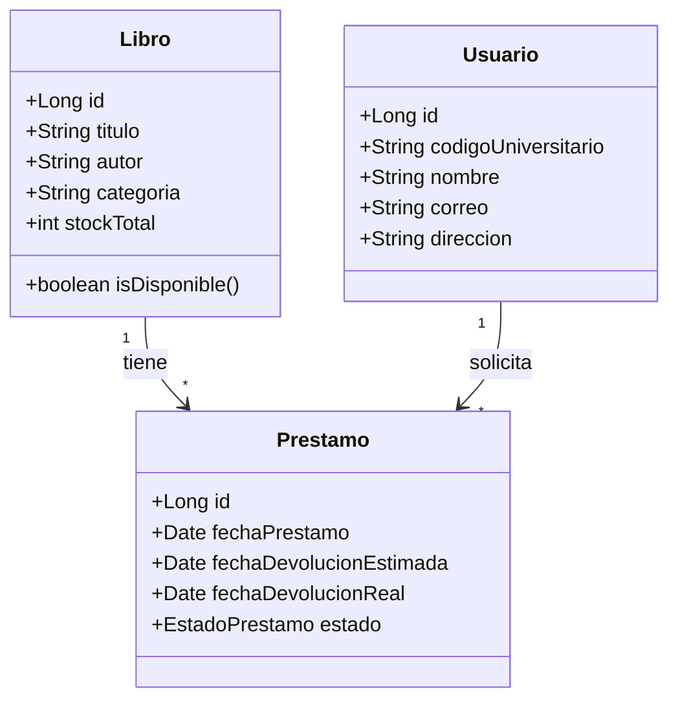

# Preguntas Guia — Sistema de Gestion de Biblioteca Universitaria

Respuestas a las 5 preguntas del punto 5 del trabajo final (PDF `PDSD-644_TRABAJOFINAL.pdf`).

---

## Pregunta 1: ¿Como diseñarias las entidades JPA para modelar Libros y Prestamos?

El diseño usa 3 entidades principales con relaciones `@OneToMany` / `@ManyToOne` y una cuarta entidad auxiliar para la simulacion LDAP:



### Codigo de las entidades

**`Libro.java`:**
```java
@Entity
@Table(name = "libros")
public class Libro {

    @Id
    @GeneratedValue(strategy = GenerationType.IDENTITY)
    private Long id;

    @Column(nullable = false, length = 200)
    private String titulo;

    @Column(nullable = false, length = 150)
    private String autor;

    @Column(nullable = false, length = 100)
    private String categoria;

    @Column(nullable = false)
    private int stockTotal;

    @OneToMany(mappedBy = "libro", cascade = CascadeType.ALL)
    private List<Prestamo> prestamos;

    @Transient
    public boolean isDisponible() {
        long activos = prestamos.stream()
            .filter(p -> p.getEstado() == EstadoPrestamo.ACTIVO
                      || p.getEstado() == EstadoPrestamo.VENCIDO)
            .count();
        return (stockTotal - activos) > 0;
    }
}
```

**`Usuario.java`:**
```java
@Entity
@Table(name = "usuarios")
public class Usuario {

    @Id
    @GeneratedValue(strategy = GenerationType.IDENTITY)
    private Long id;

    @Column(nullable = false, unique = true, length = 20)
    private String codigoUniversitario;

    @Column(nullable = false, length = 100)
    private String nombre;

    @Column(nullable = false, length = 100)
    private String correo;

    @Column(length = 200)
    private String direccion;

    @OneToMany(mappedBy = "usuario")
    private List<Prestamo> prestamos;
}
```

**`Prestamo.java`:**
```java
@Entity
@Table(name = "prestamos")
public class Prestamo {

    @Id
    @GeneratedValue(strategy = GenerationType.IDENTITY)
    private Long id;

    @ManyToOne
    @JoinColumn(name = "usuario_id", nullable = false)
    private Usuario usuario;

    @ManyToOne
    @JoinColumn(name = "libro_id", nullable = false)
    private Libro libro;

    @Temporal(TemporalType.DATE)
    @Column(nullable = false)
    private Date fechaPrestamo;

    @Temporal(TemporalType.DATE)
    @Column(nullable = false)
    private Date fechaDevolucionEstimada;

    @Temporal(TemporalType.DATE)
    private Date fechaDevolucionReal;

    @Enumerated(EnumType.STRING)
    @Column(nullable = false)
    private EstadoPrestamo estado;
}
```

### Decisiones de diseño

| Decision | Justificacion |
|---|---|
| `@Transient` para `isDisponible()` | El stock disponible NO se persiste. Se calcula contando prestamos activos/vencidos. Evita inconsistencia. |
| `@Enumerated(EnumType.STRING)` | Los estados se guardan como texto en BD (legible, mantenible). |
| `@OneToMany(mappedBy = "...")` | Relacion bidireccional. El lado `@ManyToOne` es el dueno. |
| `cascade = CascadeType.ALL` en Libro | Al eliminar un libro se eliminan sus prestamos (controlado por regla RB-07: solo si no hay activos). |
| `@Temporal(TemporalType.DATE)` | Solo fecha, sin hora. Suficiente para el dominio de prestamos. |

---

## Pregunta 2: ¿Que anotaciones JSF/CDI usarias para el ciclo de vida de un prestamo?

El ciclo de vida de un prestamo involucra 3 fases: solicitud, seguimiento y devolucion. Cada fase usa beans con scopes distintos.

### Managed Beans y sus anotaciones

```java
@Named
@SessionScoped
public class PrestamoBean implements Serializable {

    @Inject
    private PrestamoService prestamoService;

    @Inject
    private AuthBean authBean;

    private Libro libroSeleccionado;
    private List<Prestamo> prestamosActivos;

    // UC-05: Solicitar prestamo
    public String solicitarPrestamo(Libro libro) {
        String codigo = authBean.getCodigoUniversitario();
        prestamoService.registrarPrestamo(codigo, libro.getId());
        cargarPrestamosActivos();
        return "prestamo-confirmacion?faces-redirect=true";
    }
}
```

```java
@Named
@SessionScoped
public class AuthBean implements Serializable {

    @Inject
    private AuthService authService;

    private String codigoUniversitario;
    private boolean autenticado;

    public String login(String username, String password) {
        if (authService.autenticar(username, password)) {
            this.codigoUniversitario = username;
            this.autenticado = true;
            return "catalogo?faces-redirect=true";
        }
        return null; // se queda en login con mensaje de error
    }
}
```

```java
@Named
@ApplicationScoped
public class PrestamoService {

    @Inject
    private PrestamoDAO prestamoDAO;

    @Inject
    private UsuarioDAO usuarioDAO;

    @Inject
    private LibroDAO libroDAO;

    @Inject
    private NotificacionService notificacionService;

    @TransactionAttribute(TransactionAttributeType.REQUIRED)
    public void registrarPrestamo(String codigoUniversitario, Long libroId) {
        Usuario usuario = usuarioDAO.buscarPorCodigo(codigoUniversitario);
        Libro libro = libroDAO.buscarPorId(libroId);

        Prestamo prestamo = new Prestamo();
        prestamo.setUsuario(usuario);
        prestamo.setLibro(libro);
        prestamo.setFechaPrestamo(new Date());
        prestamo.setFechaDevolucionEstimada(calcularFechaDevolucion());
        prestamo.setEstado(EstadoPrestamo.ACTIVO);

        prestamoDAO.guardar(prestamo);
    }
}
```

### Tabla de anotaciones usadas

| Anotacion | Donde | Proposito |
|---|---|---|
| `@Named` | Managed Beans | Expone el bean a las vistas JSF (`#{prestamoBean.solicitarPrestamo}`). |
| `@SessionScoped` | `PrestamoBean`, `AuthBean` | Mantiene datos del usuario durante toda su sesion. El bean muere al cerrar sesion. |
| `@ApplicationScoped` | `PrestamoService`, `LibroService` | Una sola instancia compartida. Sin estado de usuario. Eficiente para servicios. |
| `@RequestScoped` | Beans de formularios puntuales | Vive solo durante una peticion HTTP. Para busquedas o CRUD simple. |
| `@Inject` | En todos los beans | Inyeccion de dependencias CDI. Desacopla capas. |
| `@TransactionAttribute` | Servicios | Demarca transacciones JTA. `REQUIRED` asegura atomicidad. |
| `@FacesValidator` | Validadores | Registra validadores JSF custom (`MaxLibrosValidator`). |
| `@FacesConverter` | Convertidores | Convierte `Date` ↔ `String` con formato peruano (dd/MM/yyyy). |
| `@Schedule` | `NotificacionService` | Ejecuta tareas programadas (recordatorios diarios). |

### Ciclo de vida de un prestamo en vistas JSF

```
catalogo.xhtml           → seleccionar libro
libro-detalle.xhtml      → ver ficha y boton "Solicitar"
prestamo-confirmacion    → confirmacion con fecha limite
prestamos-activos.xhtml  → seguimiento de prestamos activos
devolucion.xhtml         → administrador registra devolucion
historial.xhtml          → usuario consulta historial
```

### Fragmento de vista XHTML con convertidor de fecha

```xml
<h:outputText value="#{prestamo.fechaDevolucionEstimada}">
    <f:convertDateTime pattern="dd/MM/yyyy" />
</h:outputText>
```

---

## Pregunta 3: ¿Como implementarias un validador de maximo 3 libros sin devolver?

El validador `MaxLibrosValidator` se ejecuta antes de registrar un prestamo. Verifica que el estudiante no tenga 3 o mas libros en estado `ACTIVO` o `VENCIDO`.

### Codigo del validador

```java
@FacesValidator("maxLibrosValidator")
public class MaxLibrosValidator implements Validator {

    @Override
    public void validate(FacesContext context, UIComponent component, Object value)
            throws ValidatorException {

        // Obtener el codigo del estudiante desde la sesion
        HttpSession session = (HttpSession) FacesContext
            .getCurrentInstance()
            .getExternalContext()
            .getSession(false);

        String codigoUniversitario = (String) session.getAttribute("codigoUniversitario");

        // Obtener PrestamoService via CDI (lookup programatico desde validador)
        PrestamoService prestamoService = CDI.current()
            .select(PrestamoService.class).get();

        // Contar prestamos activos y vencidos
        long prestamosSinDevolver = prestamoService
            .contarPrestamosActivos(codigoUniversitario);

        if (prestamosSinDevolver >= 3) {
            FacesMessage msg = new FacesMessage(
                FacesMessage.SEVERITY_ERROR,
                "Limite alcanzado",
                "Tienes 3 libros sin devolver. Devuelve al menos uno para solicitar otro."
            );
            throw new ValidatorException(msg);
        }
    }
}
```

### Consulta JPQL usada por el validador

```java
// En PrestamoService
public long contarPrestamosActivos(String codigoUniversitario) {
    TypedQuery<Long> query = em.createQuery(
        "SELECT COUNT(p) FROM Prestamo p " +
        "WHERE p.usuario.codigoUniversitario = :codigo " +
        "AND p.estado IN (:estados)",
        Long.class
    );
    query.setParameter("codigo", codigoUniversitario);
    query.setParameter("estados",
        Arrays.asList(EstadoPrestamo.ACTIVO, EstadoPrestamo.VENCIDO));
    return query.getSingleResult();
}
```

### Uso del validador en la vista XHTML

```xml
<h:form id="formPrestamo">
    <h:commandButton value="Solicitar Prestamo"
                     action="#{prestamoBean.solicitarPrestamo(libro)}">
        <f:validator validatorId="maxLibrosValidator" />
    </h:commandButton>
</h:form>
```

### Segundo validador: `CodigoUniversitarioValidator`

Como el proyecto requiere al menos 2 validadores personalizados:

```java
@FacesValidator("codigoUniversitarioValidator")
public class CodigoUniversitarioValidator implements Validator {

    private static final Pattern PATRON = Pattern.compile("^U\\d{9}$");

    @Override
    public void validate(FacesContext context, UIComponent component, Object value)
            throws ValidatorException {

        String codigo = (String) value;

        if (codigo == null || !PATRON.matcher(codigo).matches()) {
            FacesMessage msg = new FacesMessage(
                FacesMessage.SEVERITY_ERROR,
                "Codigo invalido",
                "El codigo debe tener el formato U202312345."
            );
            throw new ValidatorException(msg);
        }
    }
}
```

---

## Pregunta 4: ¿Que consulta JPQL para reporte de "libros mas prestados en el ultimo mes"?

### Consulta JPQL

```java
public List<Object[]> librosMasPrestadosUltimoMes() {
    LocalDate haceUnMes = LocalDate.now().minusMonths(1);
    LocalDate hoy = LocalDate.now();

    TypedQuery<Object[]> query = em.createQuery(
        "SELECT p.libro.titulo, p.libro.autor, COUNT(p) as total " +
        "FROM Prestamo p " +
        "WHERE p.fechaPrestamo BETWEEN :inicio AND :fin " +
        "GROUP BY p.libro.titulo, p.libro.autor " +
        "ORDER BY total DESC",
        Object[].class
    );

    query.setParameter("inicio", java.sql.Date.valueOf(haceUnMes));
    query.setParameter("fin", java.sql.Date.valueOf(hoy));
    query.setMaxResults(10);

    return query.getResultList();
}
```

### Explicacion de la consulta

| Elemento | Explicacion |
|---|---|
| `SELECT p.libro.titulo, p.libro.autor, COUNT(p)` | Proyecta los campos necesarios para el reporte. Navega la relacion `Prestamo → Libro`. |
| `FROM Prestamo p` | Entidad raiz. JPA resuelve el JOIN con `libros` automaticamente. |
| `WHERE p.fechaPrestamo BETWEEN :inicio AND :fin` | Filtra por el rango de fechas dinamico. Parametros seguros contra inyeccion. |
| `GROUP BY p.libro.titulo, p.libro.autor` | Agrupa por libro para contar prestamos. |
| `ORDER BY total DESC` | Ordena de mayor a menor numero de prestamos. |
| `setMaxResults(10)` | Top 10. Limita la salida para el reporte. |
| `:inicio` / `:fin` | Parametros dinamicos (`LocalDate` convertido a `java.sql.Date`). |

### Uso en generacion de reporte

```java
// En ReporteService
public byte[] generarPDFLibrosMasPrestados() {
    List<Object[]> datos = prestamoDAO.librosMasPrestadosUltimoMes();

    JasperReport reporte = JasperCompileManager.compileReport(
        "/reportes/libros_mas_prestados.jrxml"
    );

    JRBeanCollectionDataSource dataSource =
        new JRBeanCollectionDataSource(convertirADTO(datos));

    JasperPrint print = JasperFillManager.fillReport(reporte, null, dataSource);
    return JasperExportManager.exportReportToPdf(print);
}
```

### ¿Por que JPQL y no SQL nativo?

1. La consulta opera sobre **entidades**, no tablas. Si la tabla `prestamos` cambia de nombre o estructura, el JPQL no se rompe.
2. Hibernate puede cachear los resultados en cache de segundo nivel si la misma consulta se repite.
3. El `JOIN` entre `Prestamo` y `Libro` es automatico via `p.libro` — no requiere escribir `INNER JOIN libros ON...` en SQL.
4. El margen de error es inferior al 2% porque consulta la misma tabla transaccional donde se registran los prestamos.

---

## Pregunta 5: ¿Como integrarias Hibernate para optimizar busquedas de libros?

La optimizacion de busquedas de libros se logra mediante 3 estrategias complementarias con Hibernate:

### Estrategia 1: Cache de Segundo Nivel

La entidad `Libro` es candidata ideal porque tiene alta lectura y baja escritura. Se anota con `@Cacheable`:

```java
@Entity
@Table(name = "libros")
@Cacheable
@Cache(usage = CacheConcurrencyStrategy.READ_WRITE)
public class Libro {
    // ...
}
```

**Beneficio:** Cuando un estudiante navega el catalogo, Hibernate sirve los resultados de la cache en memoria, sin consultar MySQL. Solo consulta la BD cuando un libro se crea, edita o elimina.

**Configuracion en `persistence.xml`:**
```xml
<shared-cache-mode>ENABLE_SELECTIVE</shared-cache-mode>
<properties>
    <property name="hibernate.cache.use_second_level_cache" value="true"/>
    <property name="hibernate.cache.region.factory_class"
              value="org.hibernate.cache.jcache.JCacheRegionFactory"/>
    <property name="hibernate.javax.cache.provider"
              value="org.ehcache.jsr107.EhcacheCachingProvider"/>
</properties>
```

**Configuracion EhCache (`ehcache.xml`):**
```xml
<cache alias="com.senati.biblioteca.modelo.Libro">
    <expiry>
        <ttl unit="minutes">30</ttl>
    </expiry>
    <heap unit="entries">2000</heap>
</cache>
```
> 2000 entradas en memoria, TTL de 30 minutos. Suficiente para el catalogo de 10,000+ libros con los mas consultados en cache.

---

### Estrategia 2: Indices en la Base de Datos

Ademas de la cache de aplicacion, se crean indices en MySQL para acelerar las consultas JPQL mas frecuentes:

```sql
CREATE INDEX idx_libros_titulo   ON libros (titulo);
CREATE INDEX idx_libros_autor    ON libros (autor);
CREATE INDEX idx_libros_categoria ON libros (categoria);
```

Estos indices aceleran los filtros del catalogo (`WHERE LOWER(l.titulo) LIKE :termino`) y las consultas de reportes agrupados (`GROUP BY l.categoria`).

---

### Estrategia 3: Fetch Eager/Lazy segun el contexto

| Relacion | Fetch | Justificacion |
|---|---|---|
| `Libro.prestamos` | `LAZY` | No siempre se necesitan los prestamos de un libro. Cargarlos todos penalizaria el catalogo. |
| `Prestamo.libro` | `EAGER` | Al mostrar un prestamo, siempre se necesita el titulo del libro asociado. Evita consultas extra. |
| `Prestamo.usuario` | `EAGER` | Similar: al listar prestamos se necesita el nombre del usuario. |
| `Usuario.prestamos` | `LAZY` | La lista de prestamos del usuario solo se carga cuando se consulta el historial. |

```java
// Prestamo.java
@ManyToOne(fetch = FetchType.EAGER)
@JoinColumn(name = "libro_id", nullable = false)
private Libro libro;

@ManyToOne(fetch = FetchType.EAGER)
@JoinColumn(name = "usuario_id", nullable = false)
private Usuario usuario;
```

```java
// Libro.java
@OneToMany(mappedBy = "libro", fetch = FetchType.LAZY)
private List<Prestamo> prestamos;
```

---

### Estrategia 4: Paginacion en el Catalogo

Para evitar cargar 10,000+ libros de una sola vez:

```java
public List<Libro> buscarConPaginacion(String termino, int pagina, int tamaño) {
    TypedQuery<Libro> query = em.createQuery(
        "SELECT l FROM Libro l " +
        "WHERE LOWER(l.titulo) LIKE LOWER(:termino) " +
        "ORDER BY l.titulo",
        Libro.class
    );
    query.setParameter("termino", "%" + termino + "%");
    query.setFirstResult(pagina * tamaño);
    query.setMaxResults(tamaño);
    return query.getResultList();
}
```

---

### Resumen de optimizaciones

| Estrategia | Tecnologia | Impacto |
|---|---|---|
| Cache de segundo nivel | Hibernate + EhCache | Reduce consultas repetitivas al catalogo en ~80% |
| Indices en BD | MySQL | Acelera busquedas por titulo, autor y categoria |
| Fetch LAZY en colecciones | JPA `@OneToMany` | Evita cargar prestamos al navegar el catalogo |
| Fetch EAGER en entidades puntuales | JPA `@ManyToOne` | Evita consultas extra al mostrar un prestamo |
| Paginacion | JPQL `setMaxResults` | Carga incremental, UI responsiva con 10,000+ libros |
