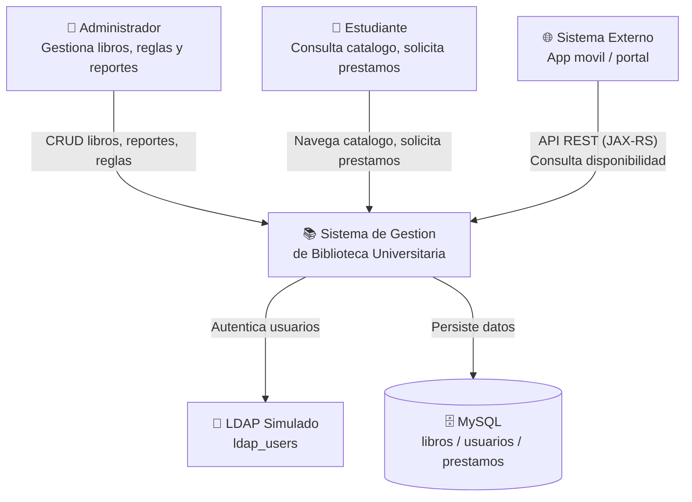
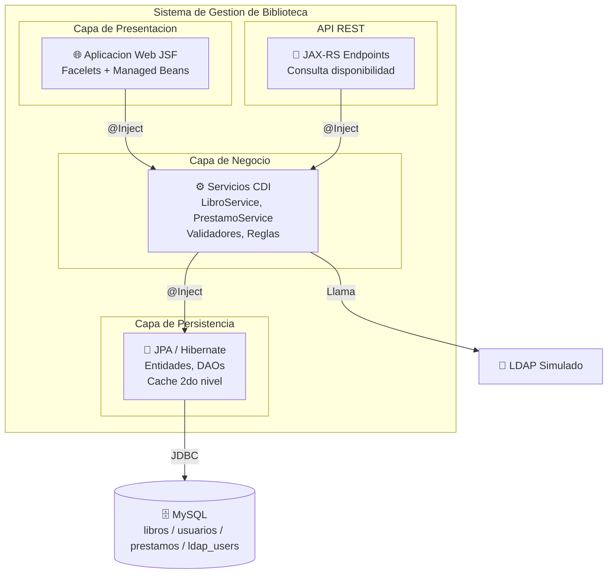
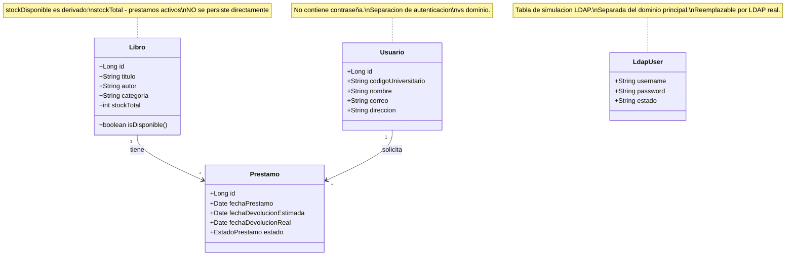

# Decisiones Tecnicas — Sistema de Gestion de Biblioteca Universitaria

## 1. Vision General del Sistema

El sistema automatiza la gestion de una biblioteca universitaria (~10,000 libros, ~5,000 usuarios, ~500 prestamos/mes) que actualmente opera con hojas de calculo, sufriendo un 30% de retrasos en devoluciones y un 15% de perdida de registros. La solucion es una aplicacion web monolítica modular que permite a estudiantes consultar el catalogo, solicitar prestamos y recibir notificaciones, mientras los administradores gestionan libros, configuran reglas y generan reportes con menos del 2% de margen de error.

### Diagrama C4 — Nivel 1: Contexto del Sistema



**Actores:**
| Actor | Rol |
|---|---|
| Administrador | Gestiona el catalogo (CRUD libros), configura reglas de prestamo, genera reportes |
| Estudiante | Navega el catalogo, busca libros, solicita prestamos, consulta su historial |
| Consumidor externo | Consulta disponibilidad de libros via API REST (solo lectura) |

**Sistemas externos:**
| Sistema | Proposito |
|---|---|
| LDAP Simulado | Autentica usuarios institucionales (`@senati.pe`). Implementado sobre tabla `ldap_users` con diseno desacoplado para futuro reemplazo por LDAP real |
| MySQL | Base de datos relacional con tablas de dominio (minimo 3: `libros`, `usuarios`, `prestamos`) + tabla de autenticacion simulada (`ldap_users`) |

---

## 2. Decisiones de Arquitectura (ADR)

### [ADR-001] Arquitectura Monolitica Modular

**Estado:** Aprobada

**Contexto:**
Se requiere una aplicacion web que gestione todos los procesos de la biblioteca. La escala del sistema (~500 prestamos/mes, 5 empleados) no justifica una arquitectura distribuida en esta fase inicial.

**¿Qué se eligió y por qué?**

Arquitectura monolítica modular desplegada como un único artefacto (`.war`) sobre un servidor de aplicaciones Java EE.

- Simplicidad de despliegue y mantenimiento.
- Trazabilidad integral de transacciones en un solo contexto.
- Adecuado para un equipo de desarrollo reducido (1 persona).
- Las capas internas estan desacopladas via CDI, lo que permite una evolucion futura hacia microservicios si la escala lo demanda.

**¿Qué se descartó y por qué?**

| Opción descartada | Motivo del rechazo |
|---|---|
| Microservicios | Sobredimensionado para la escala actual (~500 prestamos/mes). Agregaria complejidad operativa innecesaria (descubrimiento, balanceo, tolerancia a fallos). |
| Serverless / FaaS | No adecuado para una app con estado de sesion (JSF). Costos impredecibles. |

**Consecuencias:**
- El monolito puede crecer en complejidad con el tiempo → mitigado con separacion estricta de capas.
- Escalar horizontalmente requiere escalar todo el sistema → aceptable para la carga prevista.
- Facilita el cumplimiento de todos los requisitos del curso en un solo proyecto.

---

### [ADR-002] Separacion en 4 Capas

**Estado:** Aprobada

**Contexto:**
Para mantener el codigo organizado, testeable y mantenible, se requiere una clara separación de responsabilidades.

**¿Qué se eligió y por qué?**

El sistema se estructura en 4 capas lógicas:

| Capa | Responsabilidad | Tecnologia |
|---|---|---|
| Presentacion | Vistas XHTML, Managed Beans controladores | JSF (Facelets) |
| Negocio | Servicios, validaciones, reglas | CDI (`@Named`, `@Inject`) |
| Persistencia | Entidades JPA, repositorios/DAOs | JPA + Hibernate |
| Datos | Almacenamiento relacional | MySQL |

- La separacion de responsabilidades (SoC) facilita el testing unitario de cada capa.
- CDI permite inyectar servicios (`@Inject`) sin acoplar la capa de presentacion a la implementacion concreta de la capa de negocio.
- Cumple con el requisito del curso de usar Managed Beans con `@Named` y `@SessionScoped`.

**¿Qué se descartó y por qué?**

| Opción descartada | Motivo del rechazo |
|---|---|
| MVC sin capa de negocio explicita | Logica dispersa entre Managed Beans y DAOs. Dificil de testear y mantener. |
| Arquitectura hexagonal (puertos/adaptadores) | Excesiva para el alcance del proyecto. Anadiria abstraccion innecesaria. |

**Consecuencias:**
- Cada capa depende solo de la capa inferior inmediata.
- Los Managed Beans nunca acceden directamente a la base de datos.
- Las entidades JPA no contienen logica de negocio.

### Diagrama C4 — Nivel 2: Contenedores



---

### [ADR-003] JSF + Facelets para la Capa de Presentacion

**Estado:** Aprobada

**Contexto:**
El curso exige el uso de JSF como tecnologia de presentacion. Se necesita definir la estrategia de implementacion de las vistas.

**¿Qué se eligió y por qué?**

JavaServer Faces (JSF) con Facelets (XHTML) como motor de plantillas, Managed Beans con anotaciones CDI (`@Named`, `@SessionScoped`) como controladores, y componentes JSF estandar para formularios, tablas y navegacion.

- Facelets permite vistas limpias sin scriptlets Java.
- Componentes JSF integran validacion, conversion y navegacion de forma declarativa.
- Compatibilidad directa con CDI mediante `@Named` y scopes (`@SessionScoped`, `@RequestScoped`).
- Es la tecnologia de presentacion exigida por el curso.

**¿Qué se descartó y por qué?**

| Opción descartada | Motivo del rechazo |
|---|---|
| JSP (JavaServer Pages) | Tecnologia legacy. Mezcla logica con presentacion. Facelets es el estandar moderno para JSF. |
| Thymeleaf / Spring MVC | No son parte del stack Java EE / Jakarta EE. No cumplen el requisito del curso. |

**Consecuencias:**
- Se requieren convertidores de fechas personalizados para el formato peruano (dd/MM/yyyy).
- Se implementaran al menos 2 validadores JSF personalizados (maximo de libros, formato de codigo universitario).
- Las vistas se almacenan en `src/main/webapp/`.

---

### [ADR-004] CDI para Desacoplamiento entre Capas

**Estado:** Aprobada

**Contexto:**
Se necesita un mecanismo de inyeccion de dependencias que permita que la capa de presentacion consuma servicios de negocio sin acoplarse a implementaciones concretas.

**¿Qué se eligió y por qué?**

CDI (Contexts and Dependency Injection) como mecanismo de inyeccion, con Managed Beans anotados con `@Named` y scopes definidos segun la naturaleza del bean (`@SessionScoped` para datos de sesion de usuario, `@RequestScoped` para operaciones puntuales, `@ApplicationScoped` para servicios compartidos).

- CDI es el estandar de Java EE para inyeccion de dependencias.
- Los scopes de CDI (`@SessionScoped`, `@RequestScoped`, etc.) se integran directamente con el ciclo de vida de JSF.
- Permite cambiar implementaciones (ej: `LdapAuthService` → `RealLdapAuthService`) sin modificar consumidores, solo via `@Alternative` o `@Specializes`.

**¿Qué se descartó y por qué?**

| Opción descartada | Motivo del rechazo |
|---|---|
| Spring DI | Framework externo. CDI es nativo de Java EE y cumple la funcion sin dependencias adicionales. |
| Inyeccion manual (factories) | Genera acoplamiento y codigo boilerplate. Va contra el principio de inversion de control. |

**Consecuencias:**
- Los servicios expuestos como `@Named` pueden inyectarse directamente en vistas JSF con `#{bean.propiedad}`.
- Facilita el testing: se pueden mockear servicios facilmente.

### Diagrama C4 — Nivel 3: Componentes

```mermaid
graph TB
    subgraph Presentacion["Capa de Presentacion - JSF"]
        CatalogoBean[CatalogoBean\n@Named @SessionScoped]
        PrestamoBean[PrestamoBean\n@Named @SessionScoped]
        AuthBean[AuthBean\n@Named @SessionScoped]
    end

    subgraph Negocio["Capa de Negocio - CDI"]
        LibroService[LibroService\n@ApplicationScoped]
        PrestamoService[PrestamoService\n@ApplicationScoped]
        AuthService["<<interface>>\nAuthService"]
        LdapAuthService[LdapAuthService\n@ApplicationScoped]
        NotificacionService[NotificacionService\n@ApplicationScoped]
        ValidadorLibro[MaxLibrosValidator\n@FacesValidator]
        ValidadorCodigo[CodigoUniversitarioValidator\n@FacesValidator]
    end

    subgraph Persistencia["Capa de Persistencia - JPA"]
        LibroDAO[LibroDAO]
        PrestamoDAO[PrestamoDAO]
        UsuarioDAO[UsuarioDAO]
    end

    subgraph API["API REST - JAX-RS"]
        DisponibilidadEndpoint[DisponibilidadResource\n@Path]
    end

    CatalogoBean -->|"@Inject"| LibroService
    PrestamoBean -->|"@Inject"| PrestamoService
    AuthBean -->|"@Inject"| AuthService

    LdapAuthService -.->|"implementa"| AuthService
    CatalogoBean -->|"usa"| ValidadorCodigo
    PrestamoBean -->|"usa"| ValidadorLibro

    LibroService -->|"@Inject"| LibroDAO
    PrestamoService -->|"@Inject"| PrestamoDAO
    PrestamoService -->|"@Inject"| UsuarioDAO
    PrestamoService -->|"@Inject"| NotificacionService

    LibroDAO -->|"JPA"| MySQL[(MySQL)]
    PrestamoDAO -->|"JPA"| MySQL
    UsuarioDAO -->|"JPA"| MySQL

    DisponibilidadEndpoint -->|"@Inject"| LibroService
    LdapAuthService -->|"JDBC"| LDAP[(ldap_users)]
```

---

### [ADR-005] JPA con Hibernate para Persistencia

**Estado:** Aprobada

**Contexto:**
El curso exige JPA con Hibernate como proveedor. Se necesita definir la estrategia de mapeo, relaciones y optimizacion de consultas.

**¿Qué se eligió y por qué?**

JPA (Jakarta Persistence) con Hibernate como proveedor, incluyendo cache de segundo nivel (EhCache o Hazelcast) para reducir consultas repetitivas a la base de datos sobre entidades de lectura frecuente (catalogo de libros, datos de usuarios).

- JPA abstrae el mapeo objeto-relacional, reduciendo codigo SQL manual.
- Hibernate es el proveedor JPA mas maduro y con mejor soporte para cache de segundo nivel.
- Las relaciones `@OneToMany` / `@ManyToOne` mapean naturalmente el modelo de negocio (Libro-Prestamo, Usuario-Prestamo).
- JPQL permite consultas orientadas a objetos, facilitando reportes sin SQL nativo.
- La cache de segundo nivel reduce la carga en MySQL para el catalogo de libros (entidad de alta lectura/baja escritura).
- Es la tecnologia de persistencia exigida por el curso.

**¿Qué se descartó y por qué?**

| Opción descartada | Motivo del rechazo |
|---|---|
| JDBC puro | Codigo boilerplate excesivo. No cumple el requisito del curso. |
| MyBatis / JOOQ | Buenas herramientas, pero el curso exige explicitamente JPA/Hibernate. |

**Consecuencias:**
- Los reportes automatizados se construiran con JPQL, no con SQL nativo, alineado con el requisito del curso.
- Se debe configurar `persistence.xml` con la estrategia de cache y el dialecto de Hibernate para MySQL.

### Diagrama C4 — Nivel 4: Modelo de Entidades JPA



**Relaciones JPA:**

| Origen | Destino | Cardinalidad | Anotacion |
|---|---|---|---|
| `Libro` | `Prestamo` | 1 : N | `@OneToMany(mappedBy = "libro")` |
| `Prestamo` | `Libro` | N : 1 | `@ManyToOne @JoinColumn` |
| `Usuario` | `Prestamo` | 1 : N | `@OneToMany(mappedBy = "usuario")` |
| `Prestamo` | `Usuario` | N : 1 | `@ManyToOne @JoinColumn` |

**Estados de Prestamo (enum `EstadoPrestamo`):**

| Estado | Descripcion |
|---|---|
| `ACTIVO` | Libro prestado, dentro del plazo |
| `VENCIDO` | Libro prestado, supero la fecha de devolucion |
| `DEVUELTO` | Libro devuelto correctamente |
| `PENALIZADO` | Devuelto con retraso, se aplico penalizacion |

### Uso de JPQL en el Sistema

JPQL (Java Persistence Query Language) es el lenguaje de consulta del sistema. Opera sobre las entidades JPA (`Libro`, `Usuario`, `Prestamo`), no sobre las tablas SQL. Esto desacopla la logica de consulta del esquema fisico de MySQL y mantiene coherencia con el modelo orientado a objetos.

**Principios de uso:**
- Todas las consultas se ejecutan via `EntityManager.createQuery()` o `TypedQuery`.
- Se usan parametros dinamicos (`:param`) para evitar inyeccion.
- Se evita SQL nativo excepto en `LdapAuthService` (tabla `ldap_users` fuera de JPA).
- Las consultas de reportes retornan datos directamente de los DAOs, garantizando <2% de margen de error al consultar la fuente transaccional.

---

#### Consultas para Reportes

**Libros mas prestados (top 10):**
```java
TypedQuery<Object[]> query = em.createQuery(
    "SELECT p.libro.titulo, p.libro.autor, COUNT(p) " +
    "FROM Prestamo p " +
    "GROUP BY p.libro.titulo, p.libro.autor " +
    "ORDER BY COUNT(p) DESC",
    Object[].class
);
query.setMaxResults(10);
List<Object[]> resultados = query.getResultList();
```

**Libros por categoria:**
```java
TypedQuery<Object[]> query = em.createQuery(
    "SELECT l.categoria, COUNT(l) " +
    "FROM Libro l " +
    "GROUP BY l.categoria " +
    "ORDER BY COUNT(l) DESC",
    Object[].class
);
```

**Autores mas populares:**
```java
TypedQuery<Object[]> query = em.createQuery(
    "SELECT l.autor, COUNT(p) " +
    "FROM Prestamo p JOIN p.libro l " +
    "GROUP BY l.autor " +
    "ORDER BY COUNT(p) DESC",
    Object[].class
);
query.setMaxResults(10);
```

**Prestamos en mora (vencidos):**
```java
TypedQuery<Prestamo> query = em.createQuery(
    "SELECT p FROM Prestamo p " +
    "WHERE p.fechaDevolucionEstimada < :hoy " +
    "AND p.estado = :estadoActivo",
    Prestamo.class
);
query.setParameter("hoy", LocalDate.now());
query.setParameter("estadoActivo", EstadoPrestamo.ACTIVO);
List<Prestamo> vencidos = query.getResultList();
```

---

#### Consultas Funcionales

**Libros disponibles:**
```java
TypedQuery<Libro> query = em.createQuery(
    "SELECT l FROM Libro l " +
    "WHERE l.stockTotal > (" +
    "   SELECT COUNT(p) FROM Prestamo p " +
    "   WHERE p.libro = l " +
    "   AND p.estado IN (:estadosActivos)" +
    ")",
    Libro.class
);
query.setParameter("estadosActivos",
    Arrays.asList(EstadoPrestamo.ACTIVO, EstadoPrestamo.VENCIDO));
```

**Busqueda por filtros (catalogo):**
```java
String jpql = "SELECT l FROM Libro l WHERE 1=1";
if (titulo != null) jpql += " AND LOWER(l.titulo) LIKE LOWER(:titulo)";
if (autor  != null) jpql += " AND LOWER(l.autor) LIKE LOWER(:autor)";
if (categoria != null) jpql += " AND l.categoria = :categoria";

TypedQuery<Libro> query = em.createQuery(jpql, Libro.class);
// setParameter segun filtros activos
```

**Historial de prestamos por usuario:**
```java
TypedQuery<Prestamo> query = em.createQuery(
    "SELECT p FROM Prestamo p " +
    "JOIN FETCH p.libro " +
    "WHERE p.usuario.codigoUniversitario = :codigo " +
    "ORDER BY p.fechaPrestamo DESC",
    Prestamo.class
);
query.setParameter("codigo", codigoUniversitario);
```
> `JOIN FETCH` evita el problema N+1: carga el libro asociado en la misma consulta.

**Prestamos en un rango de fechas:**
```java
TypedQuery<Prestamo> query = em.createQuery(
    "SELECT p FROM Prestamo p " +
    "WHERE p.fechaPrestamo BETWEEN :inicio AND :fin " +
    "ORDER BY p.fechaPrestamo",
    Prestamo.class
);
query.setParameter("inicio", fechaInicio);
query.setParameter("fin", fechaFin);
```

---

**Justificacion arquitectonica:**

Usar JPQL en vez de SQL nativo permite:
1. Que las consultas sobrevivan a cambios en el esquema de la BD (renombrado de columnas, normalizacion).
2. Aprovechar la cache de segundo nivel de Hibernate (consultas repetitivas devuelven resultados cacheados).
3. Mantener la coherencia objeto-relacional: las consultas devuelven entidades gestionadas, no filas sueltas.
4. Reportes con margen de error < 2% porque consultan directamente la tabla transaccional `prestamos`.

---

### [ADR-006] MySQL — Separacion Dominio vs Autenticacion

**Estado:** Aprobada

**Contexto:**
El curso exige como **minimo** 3 tablas (`libros`, `usuarios`, `prestamos`). El diseño puede incluir tablas adicionales si el sistema lo requiere. Ademas, la autenticacion LDAP simulada necesita un almacen de credenciales separado.

**¿Qué se eligió y por qué?**

MySQL como base de datos relacional con dos contextos claramente separados:

| Contexto | Tablas | Responsabilidad |
|---|---|---|
| Dominio | `libros`, `usuarios`, `prestamos` (+ tablas adicionales si se requieren) | Gestion del negocio. Gestionado por JPA/Hibernate. |
| Autenticacion | `ldap_users` | Simulacion LDAP. Gestionado por JDBC directo (fuera del EntityManager de JPA). |

- Cumple y excede el minimo de 3 tablas exigido por el curso (4 tablas en total).
- La tabla `ldap_users` esta fuera del contexto JPA porque no es parte del modelo de dominio; es un servicio de infraestructura.
- La separacion permite reemplazar la autenticacion simulada por LDAP real sin modificar el dominio.
- La tabla `usuarios` no almacena contraseñas, cumpliendo el principio de separacion de responsabilidades (SRP).

**¿Qué se descartó y por qué?**

| Opción descartada | Motivo del rechazo |
|---|---|
| PostgreSQL / Oracle | MySQL es mas ligero, tiene mejor soporte en entornos academicos y es el motor indicado en el curso. |
| Una sola tabla `usuarios` con campo `password` | Mezcla dominio con autenticacion. Viola SRP y no permite sustitucion futura por LDAP real. |

**Consecuencias:**
- El `persistence.xml` solo mapea las entidades del dominio (`Libro`, `Usuario`, `Prestamo`).
- `LdapAuthService` accede a `ldap_users` via JDBC o un segundo `EntityManager` si se prefiere.
- Las migraciones de esquema (Flyway/Liquibase) deben considerar ambos contextos.

---

### [ADR-007] Autenticacion LDAP Simulada con Diseno Desacoplado

**Estado:** Aprobada

**Contexto:**
El curso exige integración LDAP, pero no se dispone de un servidor LDAP real en el entorno de desarrollo ni produccion. Se necesita una solucion que cumpla el requisito funcional y permita evolucion futura.

**¿Qué se eligió y por qué?**

Autenticacion LDAP simulada mediante una tabla `ldap_users` y una interfaz `AuthService` con dos implementaciones previstas:

| Implementacion | Uso |
|---|---|
| `LdapAuthService` | Implementacion actual. Valida contra tabla `ldap_users`. |
| `RealLdapAuthService` | Futura. Se conectara a un servidor LDAP real via JNDI. |

**Flujo de autenticacion:**
```
1. Usuario ingresa credenciales
2. AuthBean valida dominio institucional (@senati.pe)
3. AuthBean llama a AuthService.autenticar(username, password)
4. LdapAuthService consulta ldap_users
5. Verifica: usuario existe + contraseña coincide + estado = ACTIVO
6. Retorna true/false → AuthBean redirige al catalogo o muestra error
```

- Cumple el requisito del curso de "integracion LDAP" (el diseño y la interfaz son identicos a una integracion real).
- El desacoplamiento mediante `AuthService` (interfaz) permite cambiar la implementacion sin tocar el resto del sistema.
- Facilita el testing: se puede mockear `AuthService` en pruebas unitarias de los Managed Beans.

**¿Qué se descartó y por qué?**

| Opción descartada | Motivo del rechazo |
|---|---|
| LDAP real desde el inicio | Requiere infraestructura no disponible. Complicaria el desarrollo y las pruebas. |
| Autenticacion directa en `usuarios` | Mezcla dominio con autenticacion. Viola SRP. No cumple el requisito de integracion LDAP. |

**Consecuencias:**
- `LdapAuthService` accede a `ldap_users` via JDBC (no JPA), manteniendo la separacion de contextos.
- Las contraseñas en `ldap_users` deben almacenarse con hash (BCrypt) para que la simulacion sea realista y segura.
- El cambio a LDAP real solo requiere implementar `RealLdapAuthService` y modificar una linea de configuracion CDI (`@Alternative`).

---

### [ADR-008] API REST con JAX-RS — Alcance Limitado

**Estado:** Aprobada

**Contexto:**
El curso exige un servicio RESTful (JAX-RS) para consulta de disponibilidad de libros. Se debe definir su alcance y su relacion con el resto del sistema.

**¿Qué se eligió y por qué?**

Un endpoint REST con JAX-RS dentro del mismo monolito, exponiendo unicamente consulta de disponibilidad de libros. La API NO es consumida por las vistas JSF; esta disenada para consumo externo (app movil, portal, otros sistemas).

| Metodo | Endpoint | Respuesta |
|---|---|---|
| `GET` | `/api/libros/{id}/disponibilidad` | `{ "disponible": true, "stockDisponible": 3 }` |
| `GET` | `/api/libros?titulo=java&autor=bloch` | `[{ "id": 1, "titulo": "...", "disponible": true }]` |

- JAX-RS es el estandar de Java EE para servicios RESTful, exigido por el curso.
- Al residir en el mismo monolito, comparte los servicios CDI via `@Inject`, evitando duplicacion de logica.
- El alcance limitado (solo lectura, solo disponibilidad) reduce riesgos de seguridad y simplifica la implementacion.

**¿Qué se descartó y por qué?**

| Opción descartada | Motivo del rechazo |
|---|---|
| Spring REST | No es parte del stack Java EE. JAX-RS es el estandar. |
| Exponer CRUD completo via REST | Excede el requisito del curso. Aumenta la superficie de ataque sin necesidad. |

**Consecuencias:**
- El `DisponibilidadResource` inyecta `LibroService` via CDI, reutilizando la misma logica que usan las vistas JSF.
- La API no requiere autenticacion (datos publicos del catalogo).
- Si en el futuro se necesita una API mas amplia, JAX-RS escala naturalmente.

---

### [ADR-009] Disponibilidad Derivada — No Persistida

**Estado:** Aprobada

**Contexto:**
Se necesita saber si un libro esta disponible para prestamo. Persistir este dato genera riesgo de inconsistencia (desincronizacion entre `stockDisponible` y los prestamos reales).

**¿Qué se eligió y por qué?**

La disponibilidad de un libro se calcula en tiempo real, **no se persiste**:

```
disponible = stockTotal - cantidad de prestamos en estado ACTIVO o VENCIDO
```

El metodo `isDisponible()` en la entidad `Libro` retorna `true` si el calculo es mayor a 0.

- Garantiza consistencia: el dato siempre refleja el estado real de los prestamos.
- A 500 prestamos/mes, el costo de la consulta de conteo es insignificante.
- Elimina la necesidad de sincronizar dos fuentes de verdad.
- Se alinea con el principio de "single source of truth": la verdad esta en la tabla `prestamos`.

**¿Qué se descartó y por qué?**

| Opción descartada | Motivo del rechazo |
|---|---|
| Columna `stockDisponible` persistida | Riesgo de inconsistencia si un prestamo se registra pero el campo no se actualiza. Requiere triggers o actualizaciones manuales. |
| Vista materializada en BD | Introduce latencia entre el dato real y el consultado. No justificada para esta escala. |

**Consecuencias:**
- El endpoint REST y las vistas JSF consultan `isDisponible()` sin preocuparse por desincronizacion.
- JPQL para reportes usa COUNT de prestamos activos, no una columna precalculada.
- Si la escala crece drasticamente, se puede anadir cache de la consulta de disponibilidad sin cambiar el modelo de datos.

---

### [ADR-010] Separacion de Credenciales del Dominio

**Estado:** Aprobada

**Contexto:**
La entidad `Usuario` representa a un estudiante en el dominio del negocio (prestamos, historial, notificaciones). Mezclar credenciales de autenticacion en esta entidad viola el principio de responsabilidad única.

**¿Qué se eligió y por qué?**

La entidad `Usuario` **NO contiene campo `password`** ni ningun dato de autenticacion. Las credenciales residen exclusivamente en `ldap_users` (o en el futuro servidor LDAP real).

- Separacion de responsabilidades (SRP): `Usuario` gestiona el perfil del estudiante; `ldap_users` gestiona la autenticacion.
- Coherencia con arquitecturas reales: en entornos corporativos, la autenticacion siempre es externa (LDAP, OAuth, SAML).
- Facilita cumplir el requisito del curso de "integracion LDAP" con un diseño profesional.

**¿Qué se descartó y por qué?**

| Opción descartada | Motivo del rechazo |
|---|---|
| Campo `password` en `usuarios` | Mezcla dominio con autenticacion. Viola SRP. Impide migrar a LDAP real. |
| Token de autenticacion en `usuarios` | Agrega complejidad innecesaria. La autenticacion debe delegarse al servicio externo. |

**Consecuencias:**
- Para obtener datos de un usuario autenticado, el sistema busca por `codigoUniversitario` (que actua como puente entre `ldap_users.username` y `usuarios.codigoUniversitario`).
- El registro de nuevos usuarios en el dominio es independiente del registro en LDAP.

---

## 3. Consideraciones de Escalabilidad Futura

El diseño actual permite evolucion sin reescribir el sistema:

| Evolucion | Como se habilita |
|---|---|
| LDAP simulado → LDAP real | Implementar `RealLdapAuthService` que implemente `AuthService`. Cambiar una anotacion CDI (`@Alternative`). |
| Monolito → modulos desplegables | Las capas estan desacopladas via interfaces. CDI permite cambiar implementaciones sin modificar consumidores. |
| Nuevos endpoints REST | JAX-RS soporta agregar recursos sin afectar las vistas JSF. |
| Escalado horizontal | La cache de segundo nivel de Hibernate reduce carga en BD. Si se requiere clustering, WildFly/Payara soportan sesiones distribuidas. |
| Reportes mas complejos | JPQL escala a consultas avanzadas. Alternativa futura: motor de reportes (JasperReports) consumiendo los mismos DAOs. |
